# AICF-Core Architecture

Visual documentation of AICF-Core architecture, data flow, and system design.

## Table of Contents

- [System Overview](#system-overview)
- [Component Architecture](#component-architecture)
- [Data Flow](#data-flow)
- [Memory Lifecycle](#memory-lifecycle)
- [File Structure](#file-structure)
- [Query Processing](#query-processing)
- [Concurrency Model](#concurrency-model)

---

## System Overview

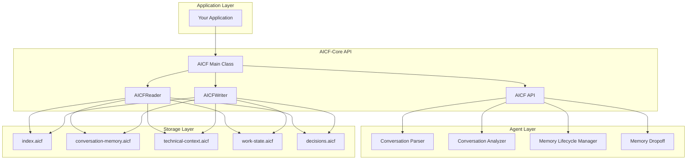

---

## Component Architecture

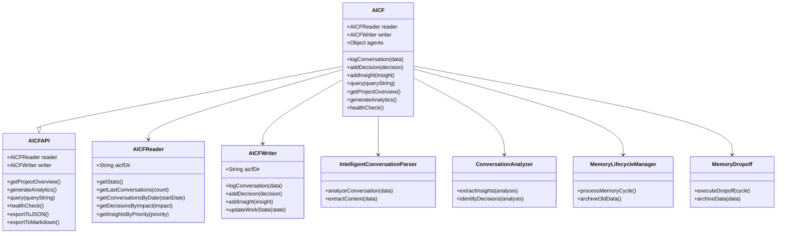

---

## Data Flow

### Write Operation Flow

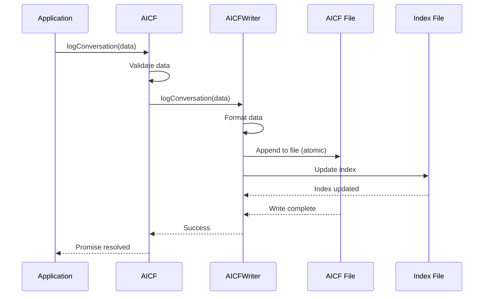

### Read Operation Flow

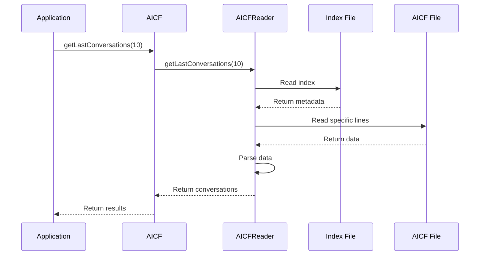

### Query Operation Flow

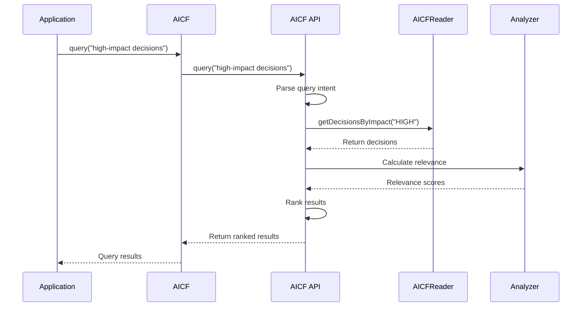

---

## Memory Lifecycle

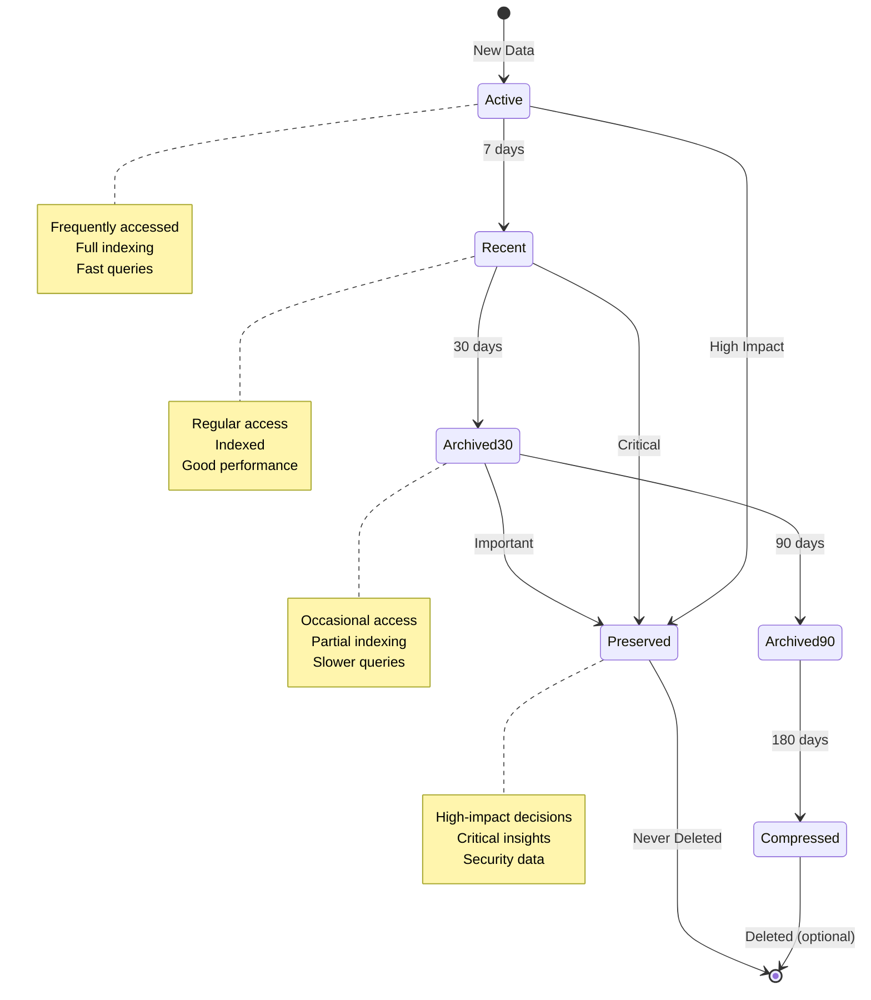

---

## File Structure

```mermaid
graph TD
    subgraph ".aicf Directory"
        INDEX[index.aicf<br/>Fast lookup metadata]
        CONV[conversation-memory.aicf<br/>Conversation history]
        TECH[technical-context.aicf<br/>Technical decisions]
        WORK[work-state.aicf<br/>Current work state]
        DEC[decisions.aicf<br/>Decision log]
    end
    
    subgraph "Index Structure"
        META[Project Metadata]
        COUNTS[Counts]
        POINTERS[File Pointers]
    end
    
    subgraph "Data File Structure"
        HEADER[@CONVERSATION]
        STATE[@STATE]
        INSIGHTS[@INSIGHTS]
        DECISIONS[@DECISIONS]
    end
    
    INDEX --> META
    INDEX --> COUNTS
    INDEX --> POINTERS
    
    CONV --> HEADER
    CONV --> STATE
    CONV --> INSIGHTS
    
    DEC --> DECISIONS
```

---

## Query Processing

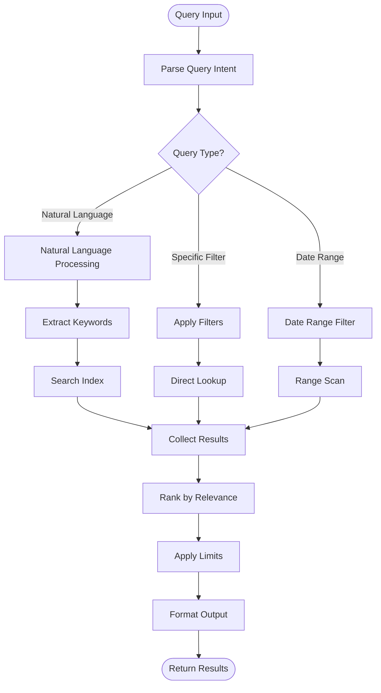

---

## Concurrency Model

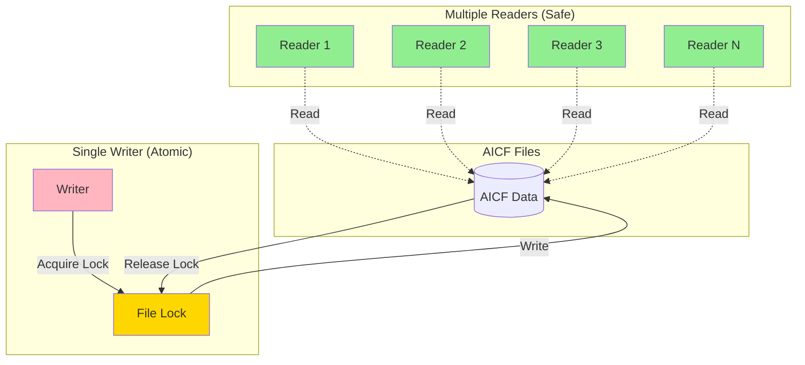

### Concurrent Access Pattern

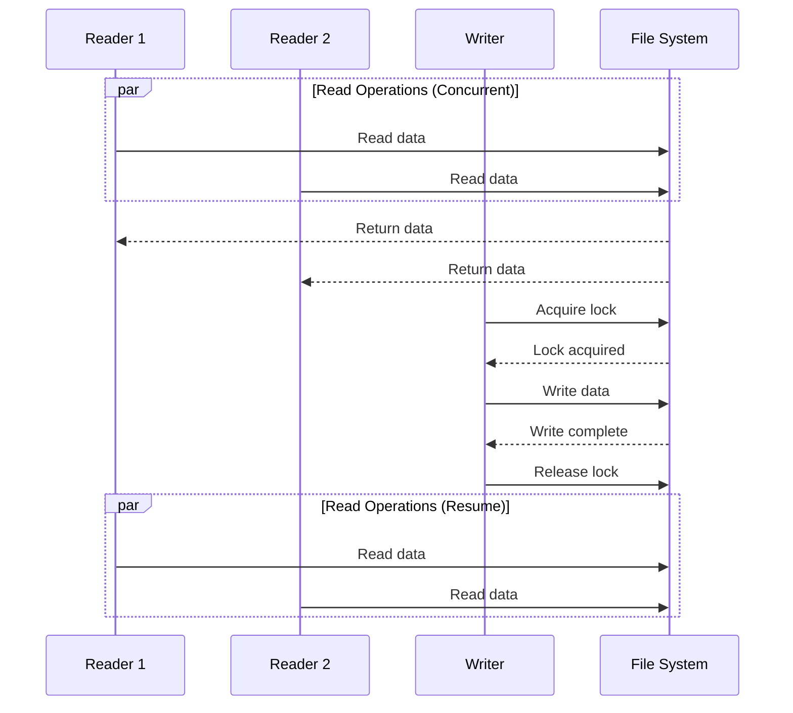

---

## Performance Characteristics

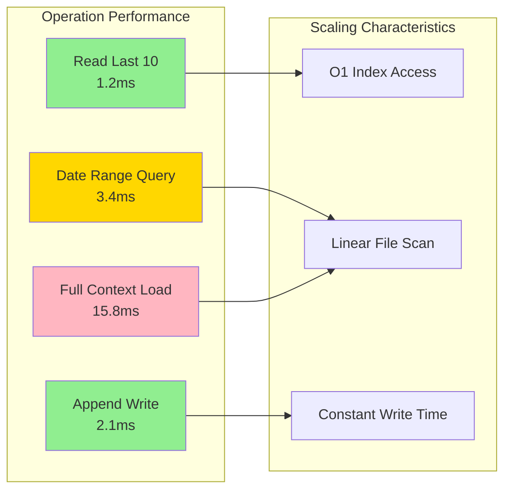

---

## Compression Technology

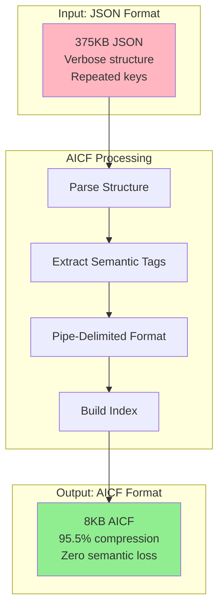

---

## Integration Architecture

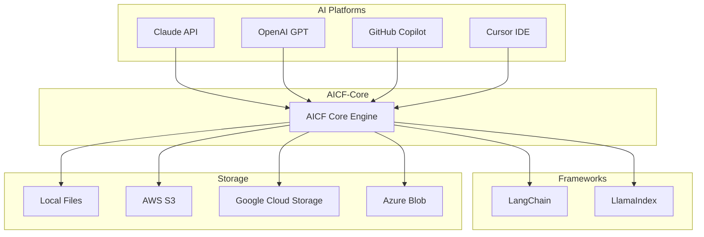

---

## Next Steps

- **[Getting Started](./GETTING_STARTED.md)** - Learn the basics
- **[API Reference](./API_REFERENCE.md)** - Complete API docs
- **[Best Practices](./BEST_PRACTICES.md)** - Production patterns
- **[Examples](../examples/)** - Working code samples

---

**AICF-Core Architecture** | **95.5% Compression, 0% Semantic Loss**

